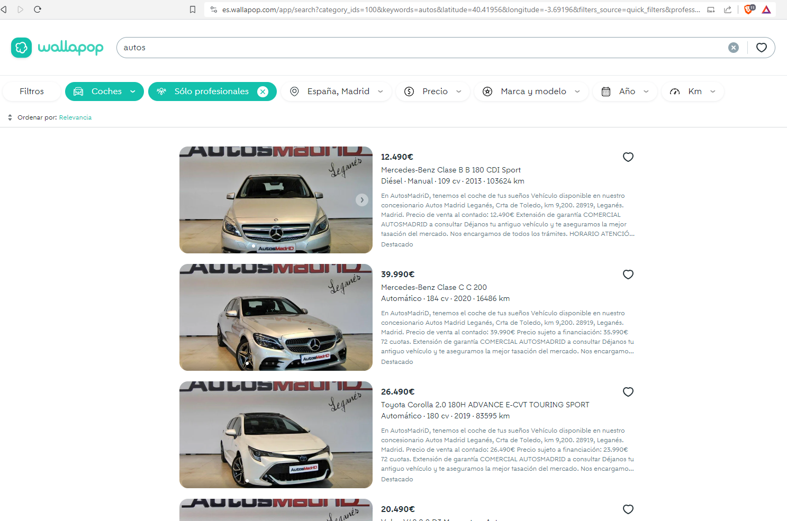
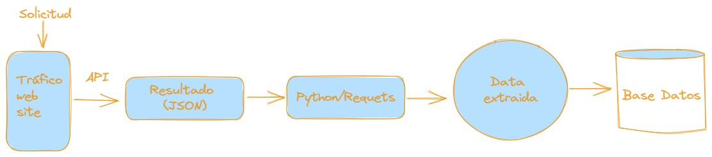

# Practica2CochesWallaPop
Seleccionar Coches de WallaPop

## Extracción de datos:
### Selección del objetivo
En primera instacia se determinó el interés sobre un tema en particular, que fue el análisis de el mercado de vehículos usados, se estableció una portal web dedicado al comercio como WALLAPOP
https://es.wallapop.com/

Proceso para analizar el portal web y así examinar el mecanismo de funcionamiento de la misma
en cuanto al consumo de datos, luego de aplicar reingeniería a la estructura del portal
se pudo encontar que utilizaba APIs, y de esta manera se procedio a consumir este recuros para la estracción de datos.

1. Determinación de la API:
2. Método extracción de datos
3. Programación del aplicativo para extraer los datos de la API
4. Almacenado de los datos en la base de datos

### 1. Determinación de la APi: 
    Mediante el análisis de la esctructura se encontró la siguiente API https://es.wallapop.com/app/search?category_ids=100&keywords=autos&latitude=40.41956&longitude=-3.69196&filters_source=quick_filters&professional=true
### 2. Método extracción de datos:
    Mediante la libreria REQUEST, se realiza la captura de los datos en formato JSON
    y con la exploración de esta estructura se extraen los datos.

### 3. Programación del aplicativo para extraer los datos de la API:
Utilizando el lenguaje de programación Python y algunas librerias contenidas en el
archivo requeriments con el siguiente contenido:

- **requests==2.31.0**
- **pymongo==4.5.0**
- **python-dotenv==1.0.0**
 
Los módulos necesarios para el funcionamiento de la aplicación son: 
- **main.py** .- Módulo principal y de inicio se utilizan las librerias de *requests* y la referenciación de la API
  se extraer los datos en formato JSON, se identifica los keys de los datos requeridos, para este caso:
- 